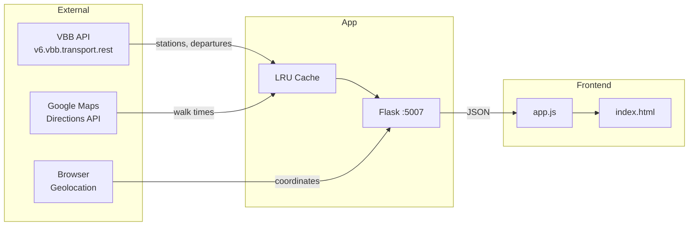

# Trainspotter

Real-time Berlin public transport departure board with walk-time-aware color coding.

## Tech Stack

Python 3.12, Flask, VBB Transport REST API, Google Maps Directions API, Vanilla JS frontend

## Architecture



## Prerequisites

- Python 3.12+
- Poetry
- Google Maps API key (for dynamic walk time calculation)

## Installation

1. Install dependencies:
   ```bash
   poetry install
   ```

2. Configure `config.json`:
   ```json
   {
       "stations": {
           "gesundbrunnen": {
               "walk_time": 15
           }
       },
       "walk_time_buffer": 2,
       "location": {
           "latitude": 52.552045,
           "longitude": 13.399863
       },
       "update_interval_min": 30,
       "min_departure_time_min": 5,
       "gmaps_api_key": "YOUR_API_KEY"
   }
   ```

   | Field | Required | Description |
   |-------|----------|-------------|
   | `stations.<name>.walk_time` | No | Preconfigured walk time in minutes (overrides Google Maps) |
   | `walk_time_buffer` | Yes | Buffer ± minutes for yellow threshold zone |
   | `location.latitude/longitude` | Yes | Default coordinates (fallback if browser geolocation unavailable) |
   | `update_interval_min` | Yes | Departure fetch window in minutes |
   | `min_departure_time_min` | Yes | Minimum time until departure to display |
   | `gmaps_api_key` | Yes | Google Maps API key for walk time calculations |

## Running

```bash
python app.py
```

Web UI: http://localhost:5007

Terminal view (no server):
```bash
python trainspotter.py
```

## Project Structure

```
trainspotter/
├── app.py                  # Flask server, API endpoints
├── trainspotter.py         # CLI terminal view (standalone)
├── vbb_api.py              # VBB API client, station/departure fetching
├── utils.py                # Walk time, thresholds, bearing calculations
├── datamodels.py           # Dataclasses: Station, Departure, Line, etc.
├── config.json             # User configuration
├── static/
│   ├── app.js              # Frontend logic, rendering, filters
│   └── styles.css          # Styling with BVG/VBB line colors
├── templates/
│   └── index.html          # Main page template
└── install/
    ├── install.sh          # Raspberry Pi deployment script
    └── projects_trainspotter.service  # systemd unit file
```

## API Endpoints

| Endpoint | Method | Description |
|----------|--------|-------------|
| `/` | GET | Main dashboard page |
| `/api/location` | POST | Receive browser geolocation `{latitude, longitude}` |
| `/api/stations` | GET | Returns nearby stations with departures |

### `GET /api/stations` Response

```json
{
  "stations": [
    {
      "name": "S Gesundbrunnen",
      "distance": 450,
      "walkTime": 15,
      "departures": [
        {
          "transport_type": "S-Bahn",
          "line": "S41",
          "when": "2025-01-01T12:30:00+01:00",
          "direction_symbol": "↻",
          "provenance": "Ringbahn",
          "wait_time": 8
        }
      ],
      "timeConfig": {
        "buffer": 13,
        "yellowThreshold": 17
      }
    }
  ],
  "config": { ... }
}
```

## Key Concepts

| Concept | Description |
|---------|-------------|
| `walk_time` | Minutes to walk from user location to station |
| `wait_time` | `minutes_until_departure - walk_time`. Negative = can't make it |
| `buffer` / `red_threshold` | `walk_time - walk_time_buffer`. Below this = red (miss train) |
| `yellow_threshold` | `walk_time + walk_time_buffer`. Between red and yellow = tight timing |
| `direction_symbol` | Cardinal arrow (↑↓←→) or ring direction (↻↺ for S41/S42) |
| `transport_type` | Normalized: `S-Bahn`, `U-Bahn`, `Tram`, `Bus`, `DB` |
| `provenance` | Cleaned destination name (strips "Hauptbahnhof" → "HBF", etc.) |

### Color Thresholds

For a station with `walk_time=15` and `buffer=2`:
- 🔴 Red: < 13 min (can't make it)
- 🟡 Yellow: 13-17 min (tight)
- 🟢 Green: > 17 min (comfortable)

## Data Models

```
Station
├── id: str
├── name: str
├── location: Location (lat/long)
├── products: Products (suburban, subway, tram, bus, ferry, express, regional)
└── distance: int (meters from user)

Departure
├── tripId: str
├── stop: Station
├── when: datetime
├── delay: int | None
├── platform: str | None
├── line: Line
│   ├── name: str (e.g., "S41")
│   ├── product: str (e.g., "suburban")
│   └── color: Color (fg, bg)
├── destination: Station
└── provenance: str
```

## External API Dependencies

### VBB Transport REST API
- Base: `https://v6.vbb.transport.rest`
- Endpoints used:
  - `/locations/nearby` - Find stations near coordinates
  - `/stops/{id}/departures` - Get departures for a station
- No auth required
- Unofficial API, no SLA

### Google Maps Directions API
- Used for walk time calculation when station not in config
- Requires API key with Directions API enabled
- Results cached via `@lru_cache`

## Deployment

### systemd (Raspberry Pi)

```bash
./install/install.sh
```

This script:
1. Creates conda environment `trainspotter`
2. Installs Poetry dependencies
3. Installs systemd service
4. Configures Cloudflare tunnel (optional)

Service file: `install/projects_trainspotter.service`

```bash
sudo systemctl status projects_trainspotter
sudo systemctl restart projects_trainspotter
journalctl -u projects_trainspotter -f
```

## License

MIT
