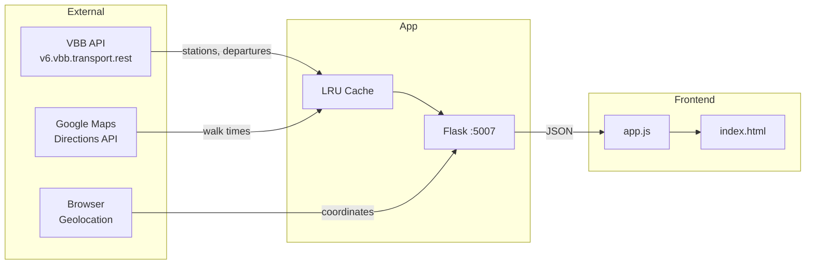

# Trainspotter

[](https://github.com/momonala/trainspotter/actions/workflows/ci.yml)
[](https://codecov.io/gh/momonala/trainspotter)

Real-time Berlin public transport departure board with walk-time-aware color coding. Optional **ESP32 e-ink display** shows a fixed station’s departures and refreshes on a schedule.

## Tech Stack

Python 3.12, Flask, VBB Transport REST API, Google Maps Directions API, Vanilla JS frontend

## Architecture



## Prerequisites

- Python 3.12+
- uv (Python package manager)
- Google Maps API key (for dynamic walk time calculation)

## Installation

1. Install dependencies:
   ```bash
   curl -LsSf https://astral.sh/uv/install.sh | sh
   uv sync
   ```

2. Configure `config.json`:
   ```json
   {
       "stations": {
           "gesundbrunnen": {
               "walk_time": 15
           }
       },
       "walk_time_buffer": 2,
       "location": {
           "latitude": 52.552045,
           "longitude": 13.399863
       },
       "update_interval_min": 30,
       "min_departure_time_min": 5,
       "eink-display": {
           "station_id": "900110011",
           "station_name": "Bornholmerstr",
           "quadrants": [ ... ]
       }
   }
   ```

   **Secrets:** Copy `src/values.example.py` to `src/values.py` (git-ignored) and set `GMAPS_API_KEY` for Google Maps walk time.

   | Field | Required | Description |
   |-------|----------|-------------|
   | `stations.<name>.walk_time` | No | Preconfigured walk time in minutes (overrides Google Maps) |
   | `walk_time_buffer` | Yes | Buffer ± minutes for yellow threshold zone |
   | `location.latitude/longitude` | Yes | Default coordinates (fallback if browser geolocation unavailable) |
   | `update_interval_min` | Yes | Departure fetch window in minutes |
   | `min_departure_time_min` | Yes | Minimum minutes until departure to display (e.g. 5 = hide departures ≤5 min) |
   | `eink-display.station_id` | Yes | VBB station ID for e-ink image API (required if using e-ink) |
   | `eink-display.station_name` | Yes | Station name shown on e-ink display |
   | `eink-display.quadrants` | Yes | List of exactly 4 quadrant specs: `key`, `label`, `lines`, `direction` (arrow symbol: ↑ ↓ ↻ ↺ ← →). Order = top-left, top-right, bottom-left, bottom-right. |

## Running

```bash
python src/app.py
```

Web UI: http://localhost:5007

Terminal view (no server):
```bash
python src/trainspotter.py
```

## Project Structure

```
trainspotter/
├── src/
│   ├── app.py              # Flask server, API endpoints
│   ├── trainspotter.py     # CLI terminal view (standalone)
│   ├── image_generator.py  # ESP32: filter, group, render 1-bit PNG
│   ├── vbb_api.py          # VBB API client, station/departure fetching
│   ├── utils.py            # Walk time, thresholds, bearing calculations
│   └── datamodels.py       # Dataclasses: Station, Departure, Line, etc.
│   └── values.example.py  # Template for values.py (copy to values.py, git-ignored)
├── config.json             # User configuration
├── static/
│   ├── app.js              # Frontend logic, rendering, filters
│   └── styles.css          # Styling with BVG/VBB line colors
├── templates/
│   └── index.html          # Main page template
├── trainspotter_eink/      # ESP32 e-ink display firmware
│   ├── trainspotter_eink.ino
│   ├── config.h            # WiFi, station, API URL (copy from config.example.h)
│   └── README.md            # Hardware, pins, build & upload
└── install/
    ├── install.sh          # Raspberry Pi deployment script
    └── projects_trainspotter.service  # systemd unit file
```

## API Endpoints

| Endpoint | Method | Description |
|----------|--------|-------------|
| `/` | GET | Main dashboard page |
| `/api/location` | POST | Receive browser geolocation `{latitude, longitude}` |
| `/api/stations` | GET | Returns nearby stations with departures |
| `/api/esp32/image` | GET | 1-bit PNG (400×300) for ESP32 e-ink. Query: `?station_id=<VBB_ID>` |

### `GET /api/stations` Response

```json
{
  "stations": [
    {
      "name": "S Gesundbrunnen",
      "distance": 450,
      "walkTime": 15,
      "departures": [
        {
          "transport_type": "S-Bahn",
          "line": "S41",
          "when": "2025-01-01T12:30:00+01:00",
          "direction_symbol": "↻",
          "provenance": "Ringbahn",
          "wait_time": 8
        }
      ],
      "timeConfig": {
        "buffer": 13,
        "yellowThreshold": 17
      }
    }
  ],
  "config": { ... }
}
```

## Key Concepts

| Concept | Description |
|---------|-------------|
| `walk_time` | Minutes to walk from user location to station |
| `wait_time` | `minutes_until_departure - walk_time`. Negative = can't make it |
| `buffer` / `red_threshold` | `walk_time - walk_time_buffer`. Below this = red (miss train) |
| `yellow_threshold` | `walk_time + walk_time_buffer`. Between red and yellow = tight timing |
| `direction_symbol` | Cardinal arrow (↑↓←→) or ring direction (↻↺ for S41/S42) |
| `transport_type` | Normalized: `S-Bahn`, `U-Bahn`, `Tram`, `Bus`, `DB` |
| `provenance` | Cleaned destination name (strips "Hauptbahnhof" → "HBF", etc.) |

### Color Thresholds

For a station with `walk_time=15` and `buffer=2`:
- 🔴 Red: < 13 min (can't make it)
- 🟡 Yellow: 13-17 min (tight)
- 🟢 Green: > 17 min (comfortable)

## Data Models

```
Station
├── id: str
├── name: str
├── location: Location (lat/long)
├── products: Products (suburban, subway, tram, bus, ferry, express, regional)
└── distance: int (meters from user)

Departure
├── tripId: str
├── stop: Station
├── when: datetime
├── delay: int | None
├── platform: str | None
├── line: Line
│   ├── name: str (e.g., "S41")
│   ├── product: str (e.g., "suburban")
│   └── color: Color (fg, bg)
├── destination: Station
└── provenance: str
```

## External API Dependencies

### VBB Transport REST API
- Base: `https://v6.vbb.transport.rest`
- Endpoints used:
  - `/locations/nearby` - Find stations near coordinates
  - `/stops/{id}/departures` - Get departures for a station
- No auth required
- Unofficial API, no SLA

### Google Maps Directions API
- Used for walk time calculation when station not in config
- Requires API key with Directions API enabled
- Results cached via `@lru_cache`

## E-ink display (ESP32)

An optional **ESP32 + 4.2" e-ink** setup shows departures for a single station. The device fetches a pre-rendered 400×300 1-bit PNG from the server and deep-sleeps between updates.

- **Hardware:** ESP32 DevKit, WeAct 4.2" e-ink (GDEY042T81, 400×300).
- **Server:** Set `eink-display.station_id`, `eink-display.station_name`, and `eink-display.quadrants` (exactly 4 entries) in `config.json`. Missing or invalid eink-display config raises an error. Each quadrant has `key`, `label`, `lines`, and `direction` (arrow symbol: ↑ ↓ ↻ ↺ ← →). The display calls `GET /api/esp32/image?station_id=...`.
- **Firmware:** See [trainspotter_eink/README.md](trainspotter_eink/README.md) for wiring, Arduino/CLI setup, and upload.

## Deployment

### systemd (Raspberry Pi)

```bash
./install/install.sh
```

This script:
1. Installs uv (if not already installed)
2. Installs dependencies via uv
3. Installs systemd service
4. Configures Cloudflare tunnel (optional)

Service file: `install/projects_trainspotter.service`

```bash
sudo systemctl status projects_trainspotter
sudo systemctl restart projects_trainspotter
journalctl -u projects_trainspotter -f
```

## License

MIT
