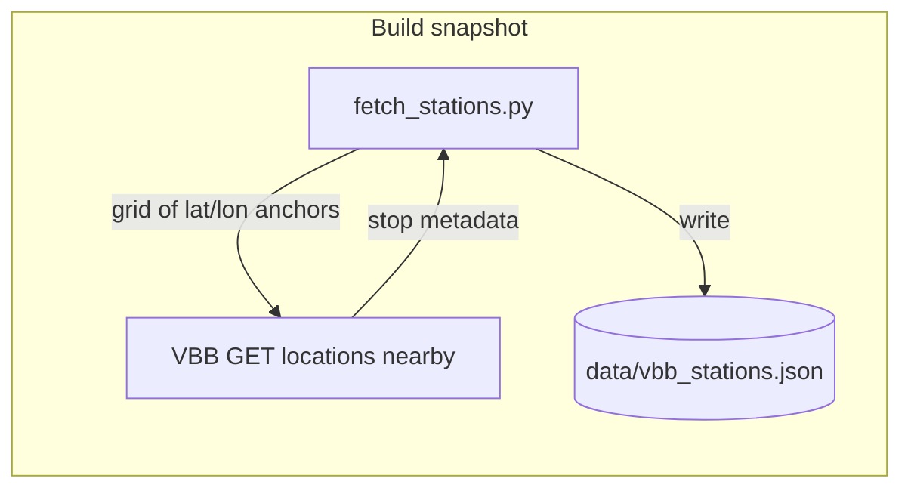
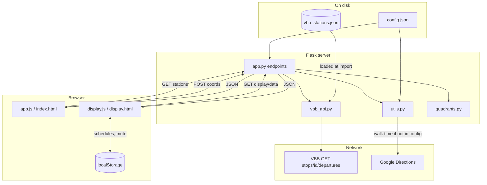
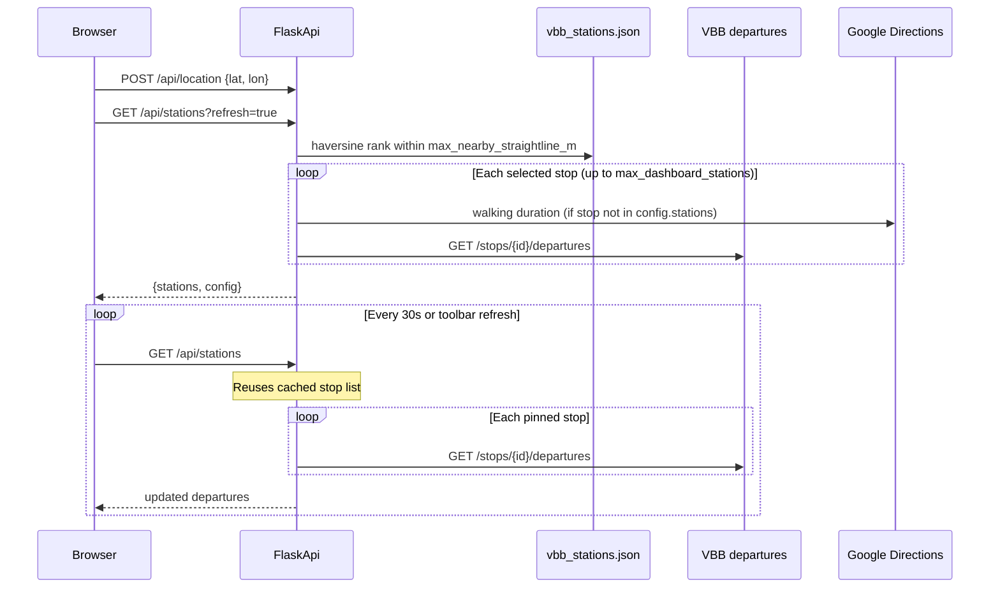
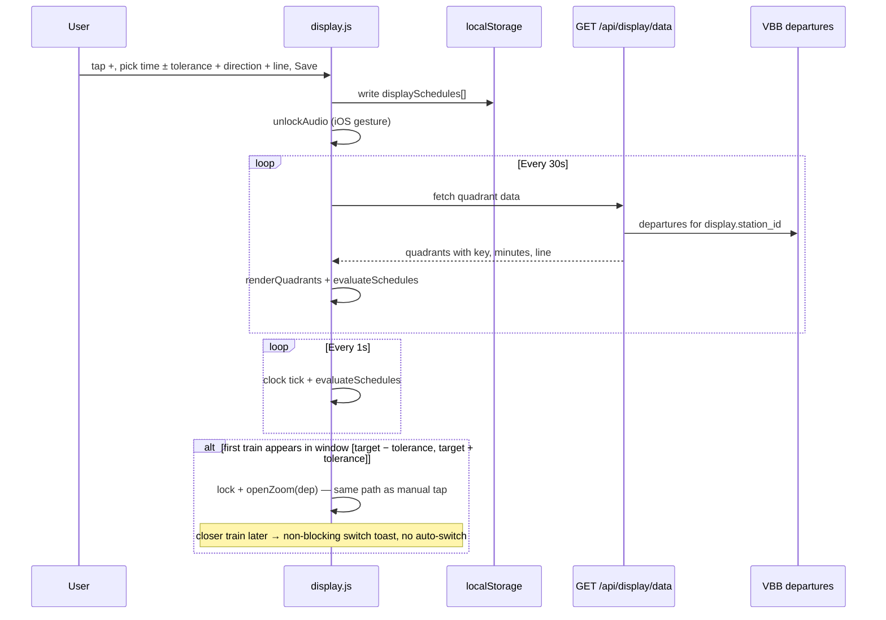

# Trainspotter

[](https://github.com/momonala/trainspotter/actions/workflows/ci.yml)
[](https://codecov.io/gh/momonala/trainspotter)

Flask web app that shows departure boards for nearby Berlin VBB stops, colour-coded by whether you have time to walk there. A second, fixed-station display renders a landscape 2×2 quadrant board for an always-on iPad mini.

---

## Module layout

```
trainspotter/
├── src/
│   ├── app.py                  # Flask server, endpoint handlers, threading
│   ├── vbb_api.py              # Station snapshot loading, haversine ranking, VBB departures client
│   ├── utils.py                # Walk time lookup, threshold calc, direction/provenance cleansing, Google Maps cache
│   ├── datamodels.py           # Dataclasses: Station, Departure, Line, Location, Products, Color, Operator
│   ├── quadrants.py            # Filter departures by quadrant config, group into QuadrantData
│   ├── config.py               # Typed config accessors (reads pyproject.toml + config.json); exposes FLASK_PORT
│   ├── trainspotter.py         # CLI terminal view (standalone, no server)
│   └── values.py.example       # Template for values.py (git-ignored); set GMAPS_API_KEY here
├── data/
│   └── vbb_stations.json       # Static stop snapshot (~thousands of stops); regenerate with scripts/fetch_stations.py
├── scripts/
│   └── fetch_stations.py       # Builds vbb_stations.json via VBB /locations/nearby grid sweep
├── static/
│   ├── app.js                  # Main dashboard: geolocation, polling, departure rendering, filter controls
│   ├── display.js              # Display page: quadrant rendering, polling, zoom modal, alarm, schedule matcher
│   ├── styles.css              # BVG/VBB line colours and main dashboard styles
│   └── display.css             # Display page: Apple Liquid Glass aesthetic, landscape 2×2 grid
├── templates/
│   ├── index.html              # Main dashboard page
│   └── display.html            # iPad display page
├── install/
│   ├── install.sh              # Raspberry Pi deployment: uv install + systemd + optional Cloudflare tunnel
│   └── projects_trainspotter.service  # systemd unit file
└── config.json                 # User configuration (see Configuration reference below)
```

---

## Architecture

Stops come from a **bundled JSON snapshot** (`data/vbb_stations.json`), not from live VBB location queries on each request. At runtime, the server ranks them by haversine distance, filters by `max_nearby_straightline_m`, then calls VBB only for departures.

### Build-time: stop snapshot

Run when the fetch grid changes or stop metadata needs refreshing (new platforms, renames):

```bash
uv run python scripts/fetch_stations.py
```


```mermaid
flowchart LR
  subgraph buildSnapshot [Build snapshot]
    Script[fetch_stations.py]
    VBBnear[VBB GET locations nearby]
    JsonFile[(data/vbb_stations.json)]
    Script -->|grid of lat/lon anchors| VBBnear
    VBBnear -->|stop metadata| Script
    Script -->|write| JsonFile
  end
```

### Runtime: component relationships


```mermaid
flowchart TB
  subgraph disk [On disk]
    Config[config.json]
    Snapshot[(vbb_stations.json)]
  end

  subgraph server [Flask server]
    Api[app.py endpoints]
    VbbMod[vbb_api.py]
    Utils[utils.py]
    Quadrants[quadrants.py]
  end

  subgraph external [Network]
    VBBdep[VBB GET stops/id/departures]
    GMaps[Google Directions]
  end

  subgraph client [Browser]
    Dashboard[app.js / index.html]
    Display[display.js / display.html]
    LocalStore[(localStorage)]
  end

  Config --> Api
  Config --> Utils
  Snapshot -->|loaded at import| VbbMod
  Dashboard -->|POST coords| Api
  Dashboard -->|GET stations| Api
  Display -->|GET display/data| Api
  Display <-->|schedules, mute| LocalStore
  Api --> VbbMod
  Api --> Utils
  Api --> Quadrants
  VbbMod --> VBBdep
  Utils -->|walk time if not in config| GMaps
  Api -->|JSON| Dashboard
  Api -->|JSON| Display
```

---

## Data flow

### Dashboard request flow

1. Browser POSTs coordinates to `/api/location` on geolocation.
2. First `GET /api/stations?refresh=true` resolves nearby stops from the snapshot and caches them server-side.
3. Each stop's departures are fetched in parallel (one thread per stop via `ThreadPoolExecutor`).
4. Walk time comes from `config.json["stations"]` if the station name matches; otherwise Google Maps (joblib disk cache in `.cache/`).
5. Subsequent polls reuse the cached stop list, re-fetching only departures.


```mermaid
sequenceDiagram
  participant Browser
  participant Flask as FlaskApi
  participant Snapshot as vbb_stations.json
  participant VBB as VBB departures
  participant GMaps as Google Directions

  Browser->>Flask: POST /api/location {lat, lon}
  Browser->>Flask: GET /api/stations?refresh=true
  Flask->>Snapshot: haversine rank within max_nearby_straightline_m
  loop Each selected stop (up to max_dashboard_stations)
    Flask->>GMaps: walking duration (if stop not in config.stations)
    Flask->>VBB: GET /stops/{id}/departures
  end
  Flask-->>Browser: {stations, config}

  loop Every 30s or toolbar refresh
    Browser->>Flask: GET /api/stations
    Note over Flask: Reuses cached stop list
    loop Each pinned stop
      Flask->>VBB: GET /stops/{id}/departures
    end
    Flask-->>Browser: updated departures
  end
```

### Display request flow

`GET /display` serves a full-viewport landscape HTML page. JavaScript polls `GET /api/display/data` every 30 seconds and re-evaluates scheduled reminders every 1 second (clock tick). The endpoint uses the fixed `station_id` from `config.json["display"]`, fetches departures from VBB, groups them into four quadrants, and returns JSON. The page renders a 2×2 quadrant grid with Apple Liquid Glass styling optimised for iPad mini in landscape mode.

The display header uses a green timer with no badge for live VBB data, and a red timer + red badge when a fetch fails — the quadrant grid is replaced by a full-screen error card until the next successful poll.


```mermaid
sequenceDiagram
  participant User
  participant Display as display.js
  participant LS as localStorage
  participant Flask as GET /api/display/data
  participant VBB as VBB departures

  User->>Display: tap +, pick time ± tolerance + direction + line, Save
  Display->>LS: write displaySchedules[]
  Display->>Display: unlockAudio (iOS gesture)

  loop Every 30s
    Display->>Flask: fetch quadrant data
    Flask->>VBB: departures for display.station_id
    Flask-->>Display: quadrants with key, minutes, line
    Display->>Display: renderQuadrants + evaluateSchedules
  end

  loop Every 1s
    Display->>Display: clock tick + evaluateSchedules
  end

  alt first train appears in window [target − tolerance, target + tolerance]
    Display->>Display: lock + openZoom(dep) — same path as manual tap
    Note over Display: closer train later → non-blocking switch toast, no auto-switch
  end
```

### Display page interactions

Tapping a departure badge opens a full-screen zoom modal with a live countdown, direction arrow, and BVG line chip. The alarm sounds (Web Audio API + red pulse) at ≤7 min, the modal auto-dismisses at ≤5 min, and the alarm auto-stops 60s after it starts. Badges at ≤7 min also pulse red on the main grid (visual only, no sound). A header speaker icon mutes/unmutes the alarm (persisted in `localStorage`). iOS Safari suspends `AudioContext` until a user gesture, so `unlockAudio()` runs on schedule-modal open/save and on manual badge taps.

### Scheduled train reminders

A client-side feature in `display.js`, persisted only in `localStorage` (`displaySchedules`) — no server involvement. The user picks a target departure time, a ±tolerance window (0–25 min, default 4), and a direction+line (validated against the live quadrant list). When a departure first appears inside that window, the zoom modal opens and **locks** onto it (same alarm/countdown as a manual tap); it holds that train until it departs, at which point the next-closest candidate locks. If a closer train appears while one is locked, a non-blocking toast offers a switch — it never switches automatically. Evaluation (`evaluateSchedules`) runs on every poll and every 1s clock tick against the live quadrant departures.

Limits: `localStorage`-only (not synced across devices, cleared with site data), a practical ~24h horizon (schedules can roll to "tomorrow" but not further), and each schedule evaluated independently with one shared zoom modal / switch toast (first match wins). `walk_time` is exposed on `/api/display/data` for dashboard parity but unused by the scheduler.

---

## Configuration reference

`config.json` — user-facing runtime configuration.

| Field | Required | Type | Description |
|-------|----------|------|-------------|
| `stations.<name>.walk_time` | No | int (minutes) | Hardcoded walk time; `<name>` is a substring matched against the station's display name (lowercase). Overrides Google Maps. |
| `walk_time_buffer` | Yes | int (minutes) | Half-width of the yellow zone around walk time. |
| `location.latitude` / `.longitude` | Yes | float | Fallback coordinates used when no browser geolocation is available. |
| `max_nearby_straightline_m` | No | int (meters) | Radius filter for stop selection from snapshot. Default: `1500`. |
| `max_dashboard_stations` | No | int | Caps the number of stops shown on the dashboard. No limit if absent. |
| `update_interval_min` | Yes | int (minutes) | VBB `duration` query param — fetch departures within this window. |
| `min_departure_time_min` | Yes | int (minutes) | Hide departures with fewer than this many minutes remaining (threshold is exclusive — a departure exactly at this value is shown). |
| `display.station_id` | Yes (display) | str | VBB stop ID used by `GET /api/display/data`. |
| `display.station_name` | Yes (display) | str | Display name shown in the header of the display page. |
| `display.quadrants` | Yes (display) | list[4] | Exactly 4 entries. Each: `key` (str), `label` (str), `lines` (list[str]), `direction` (arrow symbol). Order: top-left, top-right, bottom-left, bottom-right. |

**Direction symbols** for quadrant `direction`: `↑ ↓ ← → ↻ ↺` (↻/↺ map to S41/S42 ring direction logic in `quadrants.compute_direction`).

---

## Setup & run

**Prerequisites:** Python 3.12+, [uv](https://astral.sh/uv), Google Maps API key with Directions API enabled.

```bash
# Install uv if needed
curl -LsSf https://astral.sh/uv/install.sh | sh

uv sync
```

Copy and fill in secrets:

```bash
cp src/values.py.example src/values.py
# Set GMAPS_API_KEY in src/values.py
```

Start the server:

```bash
uv run app
# http://localhost:5007
```

Terminal-only view (no server):

```bash
uv run python src/trainspotter.py
```

Flask port and VBB API base URL are set in `pyproject.toml` under `[tool.config]`.

---

## API reference

| Endpoint | Method | Description |
|----------|--------|-------------|
| `/` | GET | Main dashboard page |
| `/display` | GET | iPad landscape display page (2×2 quadrant board) |
| `/api/location` | POST | Set server-side browser coordinates `{latitude, longitude}` |
| `/api/stations` | GET | Nearby stops with live departures. `?refresh=true` re-resolves stop list. |
| `/api/display/data` | GET | Quadrant departure data for the fixed display station. Returns 502 if VBB fails. |
| `/observability` | GET | Redirect to the Spyglass dashboard for this project |

### Observability (Spyglass)

Metrics and logs are sent to a [Spyglass](https://github.com/momonala/spyglass) server (`spyglass_host` in `pyproject.toml`). Dashboard: `/observability` → `{spyglass_host}/dashboard/trainspotter`.

Stat names are prefixed as `trainspotter.{caller_function}.{stat}`. VBB failures use tags for dashboard breakdown (`kind` on `vbb.error`, `outcome` on `vbb.fetch`).

| Stat | Type | When |
|------|------|------|
| `vbb.success` | counter | Departures HTTP fetch succeeded |
| `vbb.error` | counter | Departures fetch failed (`tags: {kind: http_503 \| timeout \| …}`) |
| `vbb.fetch` | timing | Upstream HTTP latency (`tags: {outcome: ok \| error}`) |
| `response.502` | counter | Display hard error (`tags: {route: display_data}`) |

VBB upstream errors are logged at WARNING with `error.kind` for log search in Spyglass.

### `GET /api/stations` response shape

```json
{
  "stations": [
    {
      "name": "S Gesundbrunnen",
      "distance": 450,
      "walkTime": 15,
      "departures": [
        {
          "transport_type": "S-Bahn",
          "line": "S41",
          "when": "2025-01-01T12:30:00+01:00",
          "direction_symbol": "↻",
          "provenance": "Ringbahn",
          "wait_time": 8
        }
      ],
      "timeConfig": {
        "buffer": 13,
        "yellowThreshold": 17
      }
    }
  ],
  "config": { ... }
}
```

### `GET /api/display/data` response shape

```json
{
  "station_name": "Bornholmerstr",
  "walk_time": 7,
  "timestamp": "2026-05-21T10:36:00+02:00",
  "min_departure_min": 5,
  "quadrants": [
    {
      "key": "s1_26_up",
      "label": "S1/26",
      "arrow": "↑",
      "departures": [
        { "tripId": "1|123|0|80|1012025", "minutes": 7,  "line": "S1",  "provenance": "Oranienburg" },
        { "tripId": "1|456|0|80|1012025", "minutes": 14, "line": "S26", "provenance": "Teltow Stadt" }
      ]
    },
    {
      "key": "s1_26_down",
      "label": "S1/26",
      "arrow": "↓",
      "departures": []
    },
    {
      "key": "s8_up",
      "label": "S8/85",
      "arrow": "↑",
      "departures": [{ "tripId": "1|789|0|80|1012025", "minutes": 11, "line": "S8", "provenance": "Birkenwerder" }]
    },
    {
      "key": "s8_clockwise",
      "label": "S8/85",
      "arrow": "↻",
      "departures": []
    }
  ]
}
```

| Field | Used by |
|-------|---------|
| `quadrants[].key` | Schedule matcher — ties a reminder to a quadrant (`display.quadrants[].key` in config). |
| `quadrants[].departures[].tripId` | VBB/HAFAS trip identity — schedule lock and zoom rebind across polls/delays. |
| `quadrants[].departures[].minutes` | Floor minutes until departure; matcher adds 59 s to align with zoom modal. |
| `walk_time` | Dashboard parity only; scheduler does not use it (leave-home is the zoom alarm). |

### `transport_type` normalisation

VBB `product` → displayed type:

| VBB product | `transport_type` |
|-------------|------------------|
| `suburban` | `S-Bahn` |
| `subway` | `U-Bahn` |
| `tram` | `Tram` |
| `bus` | `Bus` |
| `regional` / `express` | `DB` |

---

## Data models

```
Station
├── id: str                    # VBB stop ID
├── name: str
├── location: Location         # lat/lon
├── products: Products         # suburban, subway, tram, bus, ferry, express, regional (bool each)
├── stationDHID: str
└── distance: int              # meters from user (set at query time)

Departure
├── tripId: str
├── stop: Station
├── when: datetime             # actual departure (delay applied)
├── plannedWhen: datetime
├── delay: int | None          # seconds
├── platform: str | None
├── line: Line
│   ├── name: str              # e.g. "S41"
│   ├── product: str           # e.g. "suburban"
│   └── color: Color | None    # fg, bg hex strings
├── destination: Station | None
└── provenance: str            # raw destination name from VBB (cleansed in utils.cleanse_provenance)
```

---

## External dependencies

### VBB Transport REST API
- Base URL: `vbb_api_base` in `pyproject.toml` (`[tool.config]`). Default: `http://localhost:3000`; for the public mirror use `https://v6.vbb.transport.rest`.
- No auth required; unofficial API, no SLA.
- `/locations/nearby` — build-time only (`scripts/fetch_stations.py`)
- `/stops/{id}/departures` — live departures; retried up to 3× on 5xx, 5 s timeout per attempt
- Regenerate the local stop list: `uv run python scripts/fetch_stations.py`

### Google Maps Directions API
- Walking mode only; used when a station has no `walk_time` in `config.json`.
- Results are joblib disk-cached in `.cache/` (keyed by origin + destination coordinates).
- Requires `GMAPS_API_KEY` in `src/values.py`.

---

## License

MIT
