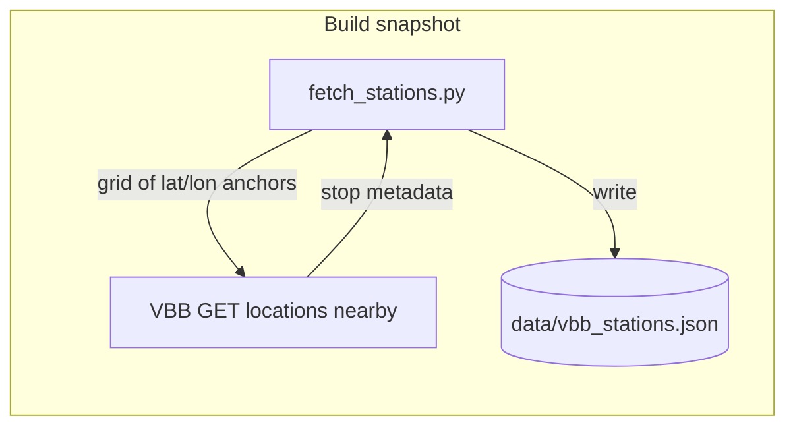
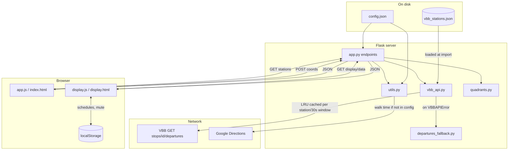
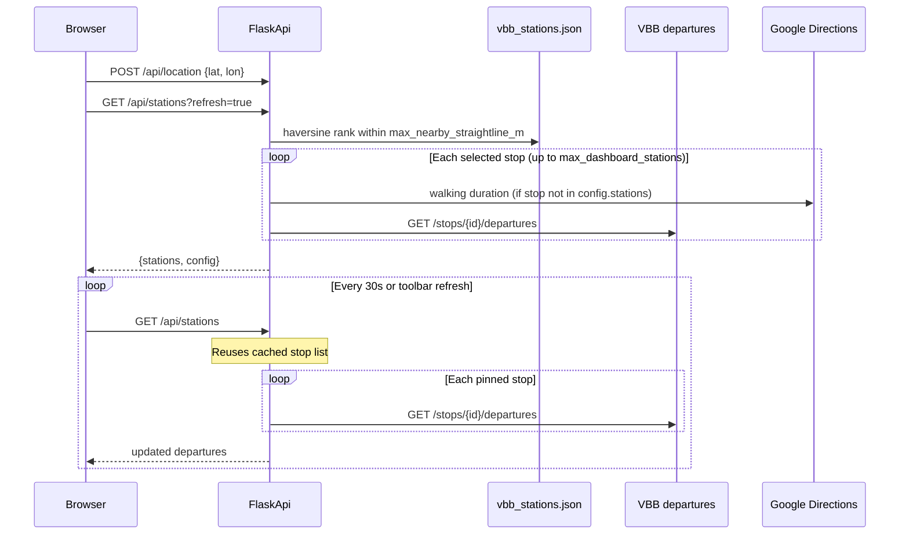
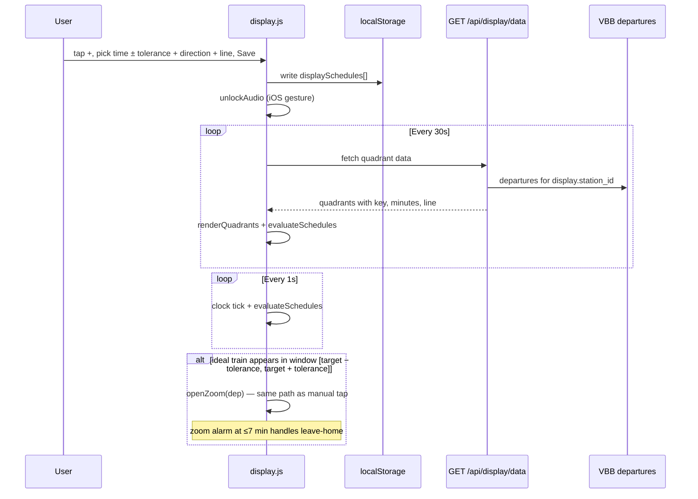
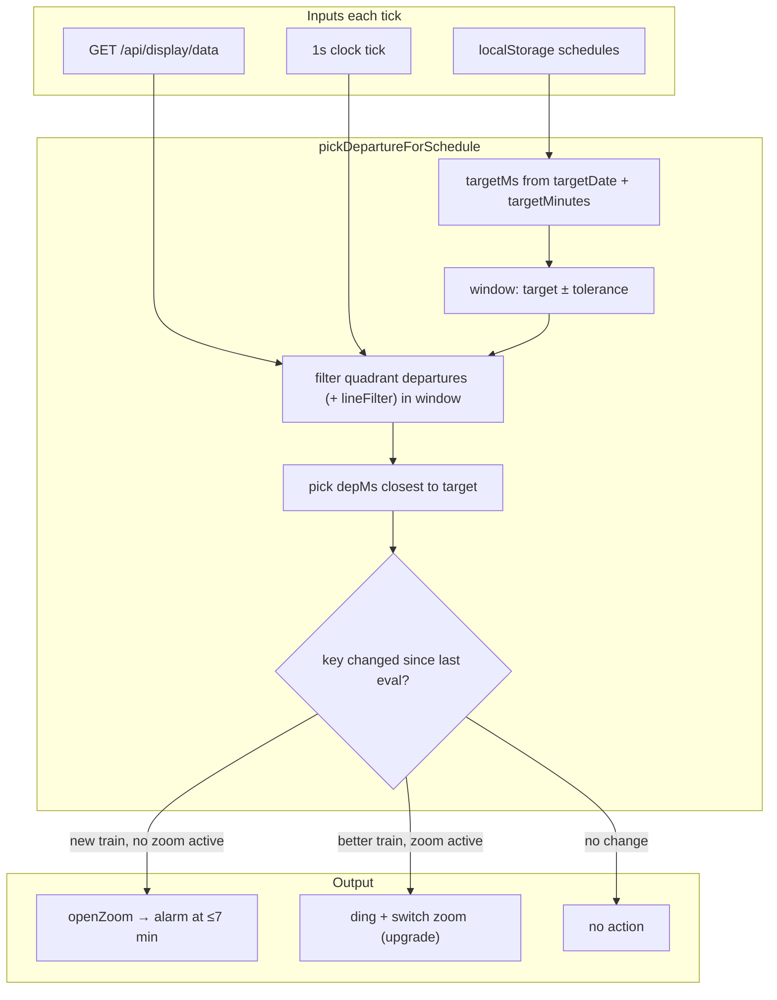

# Trainspotter

[](https://github.com/momonala/trainspotter/actions/workflows/ci.yml)
[](https://codecov.io/gh/momonala/trainspotter)

Flask web app that shows departure boards for nearby Berlin VBB stops, colour-coded by whether you have time to walk there. A second, fixed-station display renders a landscape 2×2 quadrant board for an always-on iPad mini.

---

## Module layout

```
trainspotter/
├── src/
│   ├── app.py                  # Flask server, endpoint handlers, threading
│   ├── vbb_api.py              # Station snapshot loading, haversine ranking, VBB departures client (LRU cache)
│   ├── utils.py                # Walk time lookup, threshold calc, direction/provenance cleansing, Google Maps cache
│   ├── datamodels.py           # Dataclasses: Station, Departure, Line, Location, Products, Color, Operator
│   ├── quadrants.py            # Filter departures by quadrant config, group into QuadrantData
│   ├── departures_fallback.py  # In-memory snapshot fallback for display when VBB is unreachable
│   ├── observability/          # Observability package (Spyglass metrics + dashboard aggregation)
│   │   ├── __init__.py         # Public observability exports used by app modules
│   │   ├── metrics.py          # Spyglass configure_logging, metrics collector, request decorator
│   │   ├── schemas.py          # Pydantic models for observability API payloads
│   │   └── view.py             # Spyglass fetch helpers and observability summary builders
│   ├── config.py               # Typed config accessors (reads pyproject.toml + config.json); exposes FLASK_PORT
│   ├── trainspotter.py         # CLI terminal view (standalone, no server)
│   └── values.example.py       # Template for values.py (git-ignored); set GMAPS_API_KEY here
├── data/
│   └── vbb_stations.json       # Static stop snapshot (~thousands of stops); regenerate with scripts/fetch_stations.py
├── scripts/
│   └── fetch_stations.py       # Builds vbb_stations.json via VBB /locations/nearby grid sweep
├── static/
│   ├── app.js                  # Main dashboard: geolocation, polling, departure rendering, filter controls
│   ├── display.js              # Display page: quadrant rendering, polling, zoom modal, alarm, schedule matcher
│   ├── styles.css              # BVG/VBB line colours and main dashboard styles
│   └── display.css             # Display page: Apple Liquid Glass aesthetic, landscape 2×2 grid
├── templates/
│   ├── index.html              # Main dashboard page
│   └── display.html            # iPad display page
├── install/
│   ├── install.sh              # Raspberry Pi deployment: uv install + systemd + optional Cloudflare tunnel
│   └── projects_trainspotter.service  # systemd unit file
└── config.json                 # User configuration (see Configuration reference below)
```

---

## Architecture

Stops come from a **bundled JSON snapshot** (`data/vbb_stations.json`), not from live VBB location queries on each request. At runtime, the server ranks them by haversine distance, filters by `max_nearby_straightline_m`, then calls VBB only for departures.

### Build-time: stop snapshot

Run when the fetch grid changes or stop metadata needs refreshing (new platforms, renames):

```bash
python scripts/fetch_stations.py
```


```mermaid
flowchart LR
  subgraph buildSnapshot [Build snapshot]
    Script[fetch_stations.py]
    VBBnear[VBB GET locations nearby]
    JsonFile[(data/vbb_stations.json)]
    Script -->|grid of lat/lon anchors| VBBnear
    VBBnear -->|stop metadata| Script
    Script -->|write| JsonFile
  end
```

### Runtime: component relationships


```mermaid
flowchart TB
  subgraph disk [On disk]
    Config[config.json]
    Snapshot[(vbb_stations.json)]
  end

  subgraph server [Flask server]
    Api[app.py endpoints]
    VbbMod[vbb_api.py]
    Utils[utils.py]
    Quadrants[quadrants.py]
    Fallback[departures_fallback.py]
  end

  subgraph external [Network]
    VBBdep[VBB GET stops/id/departures]
    GMaps[Google Directions]
  end

  subgraph client [Browser]
    Dashboard[app.js / index.html]
    Display[display.js / display.html]
    LocalStore[(localStorage)]
  end

  Config --> Api
  Config --> Utils
  Snapshot -->|loaded at import| VbbMod
  Dashboard -->|POST coords| Api
  Dashboard -->|GET stations| Api
  Display -->|GET display/data| Api
  Display <-->|schedules, mute| LocalStore
  Api --> VbbMod
  Api --> Utils
  Api --> Quadrants
  VbbMod -->|LRU cached per station/30s window| VBBdep
  VbbMod -->|on VBBAPIError| Fallback
  Utils -->|walk time if not in config| GMaps
  Api -->|JSON| Dashboard
  Api -->|JSON| Display
```

---

## Data flow

### Dashboard request flow

1. Browser POSTs coordinates to `/api/location` on geolocation.
2. First `GET /api/stations?refresh=true` resolves nearby stops from the snapshot and caches them server-side.
3. Each stop's departures are fetched in parallel (one thread per stop via `ThreadPoolExecutor`). VBB departures are LRU-cached keyed on `station_id + 30-second timestamp bucket`.
4. Walk time comes from `config.json["stations"]` if the station name matches; otherwise Google Maps (joblib disk cache in `.cache/`).
5. Subsequent polls reuse the cached stop list, re-fetching only departures.


```mermaid
sequenceDiagram
  participant Browser
  participant Flask as FlaskApi
  participant Snapshot as vbb_stations.json
  participant VBB as VBB departures
  participant GMaps as Google Directions

  Browser->>Flask: POST /api/location {lat, lon}
  Browser->>Flask: GET /api/stations?refresh=true
  Flask->>Snapshot: haversine rank within max_nearby_straightline_m
  loop Each selected stop (up to max_dashboard_stations)
    Flask->>GMaps: walking duration (if stop not in config.stations)
    Flask->>VBB: GET /stops/{id}/departures
  end
  Flask-->>Browser: {stations, config}

  loop Every 30s or toolbar refresh
    Browser->>Flask: GET /api/stations
    Note over Flask: Reuses cached stop list
    loop Each pinned stop
      Flask->>VBB: GET /stops/{id}/departures
    end
    Flask-->>Browser: updated departures
  end
```

### Display request flow

`GET /display` serves a full-viewport landscape HTML page. JavaScript polls `GET /api/display/data` every 30 seconds and re-evaluates scheduled reminders every 1 second (clock tick). The endpoint uses the fixed `station_id` from `config.json["display"]`, fetches departures (with in-memory fallback from `departures_fallback.py` on `VBBAPIError`), groups them into four quadrants, and returns JSON. The page renders a 2×2 quadrant grid with Apple Liquid Glass styling optimised for iPad mini in landscape mode.

When stale fallback data is served, the response includes `"used_fallback": true`. The display header uses a green timer with no badge for live VBB data, yellow timer + yellow badge for stale or unrefreshable board data, and red timer + red badge when no departures can be shown (hard fetch error).


```mermaid
sequenceDiagram
  participant User
  participant Display as display.js
  participant LS as localStorage
  participant Flask as GET /api/display/data
  participant VBB as VBB departures

  User->>Display: tap +, pick time ± tolerance + direction + line, Save
  Display->>LS: write displaySchedules[]
  Display->>Display: unlockAudio (iOS gesture)

  loop Every 30s
    Display->>Flask: fetch quadrant data
    Flask->>VBB: departures for display.station_id
    Flask-->>Display: quadrants with key, minutes, line
    Display->>Display: renderQuadrants + evaluateSchedules
  end

  loop Every 1s
    Display->>Display: clock tick + evaluateSchedules
  end

  alt ideal train appears in window [target − tolerance, target + tolerance]
    Display->>Display: openZoom(dep) — same path as manual tap
    Note over Display: zoom alarm at ≤7 min handles leave-home
  end
```

### Display page interactions

Departure badges are interactive. Tapping one opens a full-screen zoom modal showing the live countdown, direction arrow, and BVG line chip.

**Alarm thresholds (zoom modal only):**

| Threshold | Behaviour |
|-----------|-----------|
| ≤ 7 min | Alarm sounds (Web Audio API) + red pulse animation. Fires once when countdown crosses 7, then repeats every 1.8 s. |
| ≤ 5 min | Modal auto-dismisses — returns to the quadrant grid. |
| 60 s after alarm start | Alarm auto-stops (prevents indefinite noise if user walks away). |

**Urgent state (main grid):** Badges at ≤ 7 min pulse their minutes number red — no alarm, purely visual.

**Mute button:** The speaker icon in the header mutes/unmutes the alarm. State persists in `localStorage` (`alarmMuted`).

**iOS audio note:** `AudioContext` on iOS Safari starts suspended and can only be unlocked inside a user-gesture handler. `unlockAudio()` runs when opening the schedule modal (+ button) and when saving a schedule, so auto-triggered zoom alarms work. Manual badge taps also call it via `openZoom()`.

**Minutes accuracy:** The server returns integer minutes (floor value). The zoom modal offsets the departure timestamp by +59 s so the initial countdown display always matches what the badge showed, rather than appearing one minute lower on open.

### Scheduled train reminders

Client-side feature in `display.js`. No server persistence — schedules live in `localStorage` under `displaySchedules`.

#### User flow

1. Tap **+** in the header → scroll wheels for time (`HH : MM`), **± tolerance** (0–25 min, default 4), **direction** (Up/Down/Clockwise/…), and **line** (group label like `S1/26` or an individual line like `S25`).
2. Time wheels default to the current **Berlin** time. If the selected time is **≤ now**, the hint shows **Tomorrow** and save stores the next calendar day.
3. The direction + line wheels must resolve to a real quadrant. Invalid pairings (e.g. `S1/26 Clockwise`) show an inline error and disable Save. A badge appears in the header (e.g. `10:33 S25 ↓ · ±4m`).
4. Tap **×** on a badge to remove that schedule; tap its text to edit.
5. When the matcher fires, the zoom modal opens automatically (same alarm/countdown as a manual tap).

The line wheel offers both group labels (whole quadrant) and individual lines (line filter within that quadrant). The combination is validated against the live quadrant list: a pairing is valid only if some quadrant has that direction **and** carries that line (or matches that group label).

#### Spec: what the target time means

| Concept | Meaning |
|---------|---------|
| **Target time** | The train **departure** you want (e.g. 10:03). |
| **Tolerance (±)** | Half-width of the acceptable window, in minutes (0–25, default 4). |
| **Acceptable window** | Departures from `(target − tolerance)` through `(target + tolerance)` — e.g. 9:59–10:07 for `10:03 ± 4`. Any train in this window is valid; the one **closest to the target** is preferred. |
| **Leave home** | **Not** part of the scheduler. Handled by the zoom modal alarm at ≤ 7 min before departure. |

#### Spec: schedule object (`localStorage`)

Each entry in `displaySchedules`:

```json
{
  "id": "uuid",
  "targetMinutes": 633,
  "targetDate": "2026-05-24",
  "repeatDays": [],
  "quadrantKey": "s1_26_down",
  "label": "S1/26",
  "arrow": "↓",
  "lineFilter": "S25",
  "toleranceMinutes": 4,
  "activeDepartureKey": null
}
```

| Field | Description |
|-------|-------------|
| `targetMinutes` | Minutes from Berlin midnight, 0–1439 (e.g. 633 = 10:33). |
| `targetDate` | Berlin calendar day `YYYY-MM-DD` for one-time schedules. `null` for repeating schedules (date is computed dynamically from `repeatDays`). Set to tomorrow when `targetMinutes ≤ now` at save time. |
| `repeatDays` | JS day-of-week values (0=Sun … 6=Sat) on which the reminder repeats. Empty array = one-time. When non-empty, `targetDate` is `null` and the next matching calendar day is computed each evaluation. |
| `quadrantKey` | Matches `quadrants[].key` from `/api/display/data` (from `config.json` `display.quadrants`). Resolved from the direction + line wheels. |
| `label` / `arrow` | Group label and direction arrow of the resolved quadrant (for the badge). |
| `lineFilter` | Single line within the quadrant (e.g. `"S25"`), or `null` to match the whole group. |
| `toleranceMinutes` | ± window half-width in minutes (0–25). |
| `activeDepartureKey` | Runtime fingerprint `"{line}:{departureMsTimestamp}"` of the auto-selected departure; keyed on absolute departure time so the same physical train is stable across API refreshes. Cleared when no match. |

Legacy schedules without `targetDate` default to today on load, without `repeatDays` default to `[]` (one-time), and without `toleranceMinutes` default to `4`.

#### Spec: selection algorithm (`pickDepartureForSchedule`)

Evaluated on every successful poll **and** every 1 s clock tick.

1. **Target instant** — `targetDate` + `targetMinutes` in Europe/Berlin.
2. **Window** — `earliestMs = targetMs − tolerance`, `latestMs = targetMs + tolerance`. Skip the schedule once the whole window is in the past (`latestMs ≤ now`).
3. **Candidates** — departures in the scheduled quadrant where:
   - `dep.line === lineFilter` when a line filter is set
   - `depMs = now + dep.minutes×60s` (raw floor minutes — the +59s offset is only for zoom display alignment, not window matching)
   - `earliestMs ≤ depMs ≤ latestMs`
4. **Ideal train** — the candidate with the smallest `|depMs − targetMs|` (the train closest to the target).
5. **Trigger** — auto-zoom as soon as the ideal train appears in the window (no minimum-minutes-away gate). Alarm (≤ 7 min) and auto-dismiss (≤ 5 min) behave identically to a manual tap.
6. **Upgrade** — if a closer ideal train appears while one is already selected, a single ding (sine bell tone, distinct from the main alarm) plays and the zoom switches to the new train.

**Example (target 10:03 ± 4):** when a train departing 9:59–10:07 first appears in the API, the zoom opens immediately for the one nearest 10:03. The alarm at ≤ 7 min then fires to tell you to leave home.

**Tomorrow example (11 pm → 10:00 ± 4 next day):** save stores `targetDate` = tomorrow. Matcher ignores tonight's departures because their `depMs` is before `earliestMs` on the target day. Fires when a train in `[09:56, 10:04]` first appears next morning.

#### Boundaries and limits

| Topic | Behaviour |
|-------|-----------|
| **Persistence** | Browser `localStorage` only; cleared with site data; not synced across devices. |
| **Horizon** | Practical limit ~24 h (tomorrow rollover). No multi-day scheduling. |
| **API visibility** | Every departure returned by VBB within the fetch window is matchable. The display shows 3 per quadrant and reveals the rest via horizontal scroll. |
| **Multiple schedules** | Each evaluated independently; one zoom modal — first match wins unless upgrading the same schedule. |
| **Walk time** | Exposed as `walk_time` on `/api/display/data` for dashboard parity; **not** used by the scheduler. |


```mermaid
flowchart TD
  subgraph inputs [Inputs each tick]
    Poll["GET /api/display/data"]
    LS["localStorage schedules"]
    Clock["1s clock tick"]
  end

  subgraph matcher [pickDepartureForSchedule]
    Target["targetMs from targetDate + targetMinutes"]
    Window["window: target ± tolerance"]
    Filter["filter quadrant departures (+ lineFilter) in window"]
    Latest["pick depMs closest to target"]
    Trigger{"key changed since last eval?"}
  end

  subgraph output [Output]
    Zoom["openZoom → alarm at ≤7 min"]
    Upgrade["ding + switch zoom (upgrade)"]
    Idle["no action"]
  end

  Poll --> Filter
  LS --> Target
  Clock --> Filter
  Target --> Window
  Window --> Filter
  Filter --> Latest
  Latest --> Trigger
  Trigger -->|"new train, no zoom active"| Zoom
  Trigger -->|"better train, zoom active"| Upgrade
  Trigger -->|no change| Idle
```

---

## Setup & run

**Prerequisites:** Python 3.12+, [uv](https://astral.sh/uv), Google Maps API key with Directions API enabled.

```bash
# Install uv if needed
curl -LsSf https://astral.sh/uv/install.sh | sh

uv sync
```

Copy and fill in secrets:

```bash
cp src/values.example.py src/values.py
# Set GMAPS_API_KEY in src/values.py
```

Start the server:

```bash
python src/app.py
# http://localhost:5007
```

Terminal-only view (no server):

```bash
python src/trainspotter.py
```

Flask port is set in `pyproject.toml` under `[tool.config]`.

---

## Configuration reference

`config.json` — user-facing runtime configuration.

| Field | Required | Type | Description |
|-------|----------|------|-------------|
| `stations.<name>.walk_time` | No | int (minutes) | Hardcoded walk time; `<name>` is a substring matched against the station's display name (lowercase). Overrides Google Maps. |
| `walk_time_buffer` | Yes | int (minutes) | Half-width of the yellow zone around walk time. |
| `location.latitude` / `.longitude` | Yes | float | Fallback coordinates used when no browser geolocation is available. |
| `max_nearby_straightline_m` | No | int (meters) | Radius filter for stop selection from snapshot. Default: `1500`. |
| `max_dashboard_stations` | No | int | Caps the number of stops shown on the dashboard. No limit if absent. |
| `update_interval_min` | Yes | int (minutes) | VBB `duration` query param — fetch departures within this window. |
| `min_departure_time_min` | Yes | int (minutes) | Hide departures with fewer than this many minutes remaining (threshold is exclusive — a departure exactly at this value is shown). |
| `display.station_id` | Yes (display) | str | VBB stop ID used by `GET /api/display/data`. |
| `display.station_name` | Yes (display) | str | Display name shown in the header of the display page. |
| `display.quadrants` | Yes (display) | list[4] | Exactly 4 entries. Each: `key` (str), `label` (str), `lines` (list[str]), `direction` (arrow symbol). Order: top-left, top-right, bottom-left, bottom-right. |

**Direction symbols** for quadrant `direction`: `↑ ↓ ← → ↻ ↺` (↻/↺ map to S41/S42 ring direction logic in `quadrants.compute_direction`).

---

## API reference

| Endpoint | Method | Description |
|----------|--------|-------------|
| `/` | GET | Main dashboard page |
| `/display` | GET | iPad landscape display page (2×2 quadrant board) |
| `/api/location` | POST | Set server-side browser coordinates `{latitude, longitude}` |
| `/api/stations` | GET | Nearby stops with live departures. `?refresh=true` re-resolves stop list. |
| `/api/display/data` | GET | Quadrant departure data for the fixed display station. Returns 502 if VBB fails and no fallback exists. |

### `GET /api/stations` response shape

```json
{
  "stations": [
    {
      "name": "S Gesundbrunnen",
      "distance": 450,
      "walkTime": 15,
      "departures": [
        {
          "transport_type": "S-Bahn",
          "line": "S41",
          "when": "2025-01-01T12:30:00+01:00",
          "direction_symbol": "↻",
          "provenance": "Ringbahn",
          "wait_time": 8
        }
      ],
      "timeConfig": {
        "buffer": 13,
        "yellowThreshold": 17
      }
    }
  ],
  "config": { ... }
}
```

### `GET /api/display/data` response shape

```json
{
  "station_name": "Bornholmerstr",
  "walk_time": 7,
  "timestamp": "2026-05-21T10:36:00+02:00",
  "used_fallback": false,
  "quadrants": [
    {
      "key": "s1_26_up",
      "label": "S1/26",
      "arrow": "↑",
      "departures": [
        { "minutes": 7,  "line": "S1"  },
        { "minutes": 14, "line": "S26" }
      ]
    },
    {
      "key": "s1_26_down",
      "label": "S1/26",
      "arrow": "↓",
      "departures": []
    },
    {
      "key": "s8_up",
      "label": "S8/85",
      "arrow": "↑",
      "departures": [{ "minutes": 11, "line": "S8" }]
    },
    {
      "key": "s8_clockwise",
      "label": "S8/85",
      "arrow": "↻",
      "departures": []
    }
  ]
}
```

| Field | Used by |
|-------|---------|
| `quadrants[].key` | Schedule matcher — ties a reminder to a quadrant (`display.quadrants[].key` in config). |
| `quadrants[].departures[].minutes` | Floor minutes until departure; matcher adds 59 s to align with zoom modal. |
| `walk_time` | Dashboard parity only; scheduler does not use it (leave-home is the zoom alarm). |

`used_fallback: true` means VBB was unreachable and time-shifted stale departures are being served. The display page shows a yellow stale-data badge and yellow “last updated” timer in this case (not green).

### `transport_type` normalisation

VBB `product` → displayed type:

| VBB product | `transport_type` |
|-------------|------------------|
| `suburban` | `S-Bahn` |
| `subway` | `U-Bahn` |
| `tram` | `Tram` |
| `bus` | `Bus` |
| `regional` / `express` | `DB` |

---

## Data models

```
Station
├── id: str                    # VBB stop ID
├── name: str
├── location: Location         # lat/lon
├── products: Products         # suburban, subway, tram, bus, ferry, express, regional (bool each)
├── stationDHID: str
└── distance: int              # meters from user (set at query time)

Departure
├── tripId: str
├── stop: Station
├── when: datetime             # actual departure (delay applied)
├── plannedWhen: datetime
├── delay: int | None          # seconds
├── platform: str | None
├── line: Line
│   ├── name: str              # e.g. "S41"
│   ├── product: str           # e.g. "suburban"
│   └── color: Color | None    # fg, bg hex strings
├── destination: Station | None
└── provenance: str            # raw destination name from VBB (cleansed in utils.cleanse_provenance)
```

---

## External dependencies

### VBB Transport REST API
- Base: `https://v6.vbb.transport.rest`
- No auth required; unofficial API, no SLA.
- `/locations/nearby` — build-time only (`scripts/fetch_stations.py`)
- `/stops/{id}/departures` — live departures; retried up to 3× on 5xx, 5 s timeout per attempt
- Regenerate the local stop list: `python scripts/fetch_stations.py`

### Google Maps Directions API
- Walking mode only; used when a station has no `walk_time` in `config.json`.
- Results are joblib disk-cached in `.cache/` (keyed by origin + destination coordinates).
- Requires `GMAPS_API_KEY` in `src/values.py`.

---

## Deployment

### systemd (Raspberry Pi)

```bash
./install/install.sh
```

Installs uv, syncs dependencies, installs the systemd service, optionally configures a Cloudflare tunnel.

```bash
sudo systemctl status projects_trainspotter
sudo systemctl restart projects_trainspotter
journalctl -u projects_trainspotter -f
```

Service file: `install/projects_trainspotter.service`.

---

## License

MIT
