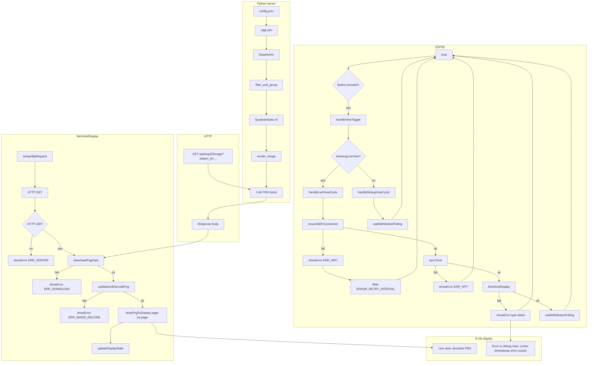

# ESP32 E-Ink Train Display

ESP32 e-ink display for S-Bahn departures. Fetches a pre-rendered 400×300 PNG from the Python server, decodes it on-device, and draws to the panel. Runs continuously (no deep sleep); updates on an interval. BOOT button toggles between live departure view and diagnostics/error screen.

## Hardware

- ESP32 (tested ESP32-32D-N4)
- WeAct 4.2" e-ink display (400×300, GDEY042T81)

## Pin Connections

| Display Pin | ESP32 Pin | Function |
|------------|-----------|----------|
| VCC        | 3.3V      | Power |
| GND        | GND       | Ground |
| SDA        | GPIO 23   | SPI MOSI |
| SCL        | GPIO 18   | SPI Clock |
| CS         | GPIO 5    | Chip Select |
| D/C        | GPIO 17   | Data/Command |
| Res        | GPIO 16   | Reset |
| BUSY       | GPIO 4    | Busy |

BOOT button (GPIO 0) toggles live view ↔ diagnostics screen.

## Data flow



**Server:** Config and VBB API produce departures; `filter_and_group` turns them into four quadrants; `render_image` draws station name, date/time, and quadrant labels + arrows + “next N minutes” badges into a 1-bit PNG.

**ESP32:** `loop()` checks for button presses, then delegates to `handleLiveViewCycle()` or `handleDebugViewCycle()`. Live view: `ensureWiFiConnected()` → `syncTime()` → `fetchAndDisplay()` (GET PNG, stream to RAM, decode via PNGdec, draw with GxEPD2). On failure, `showError()` does a full refresh and draws diagnostics (cycles, Active since, Now, Last OK, error counts). After success, waits `UPDATE_INTERVAL_SECONDS` (or `ERROR_RETRY_INTERVAL_SECONDS` on error) using `waitWithButtonPolling()` to allow button toggling without waiting the full interval.

**Button:** BOOT (GPIO 0). Toggle switches between live departure image and diagnostics. When you open diagnostics via the button, the title line shows “Error debug view” instead of the last error message.

### Error types (diagnostics screen)

The device reports 10 error categories; the diagnostics screen shows one row per type with a count. Some errors include a short detail in parentheses:

| Type | Label | Detail examples |
|------|--------|------------------|
| WiFi | WiFi connection error | — |
| Server | Server connection refused | — |
| Server | Server connection lost | — |
| Server | HTTP 502 - VBB API error | — |
| Server | HTTP 404 - not found | — |
| Server | other HTTP error | `HTTP 500`, `HTTP 503` |
| Memory | Out of memory | — |
| NTP | NTP time sync error | — |
| Download | Download error | `Size`, `Timeout`, `Incomplete` |
| Image | Image decode error | `Page decode` (or none for decode/size) |

### Serial output

At 115200 baud the serial monitor shows:

- **[WiFi]** – Connecting, Connected (IP), Disconnected reconnecting, Reconnected (IP), Reconnect failed, Failed (status)
- **[NTP]** – Syncing, OK, Failed
- **[HTTP]** – GET URL, Response code (if not 200), 200 OK, Content-Length, Body bytes and elapsed ms; Invalid size, Body read timeout, Incomplete on failure
- **[PNG]** – Decode failed, Reopen failed, Page decode failed, Too large
- **[Memory]** – Allocation failed
- **[Wait]** – Seconds until next update / retry
- **[Btn]** – pressed
- **[OK]** – Updated (after successful fetch and draw)
- **[Error]** – Error label and detail when `showError()` runs

## Setup

### 1. Install dependencies

**Arduino CLI:**
```bash
arduino-cli core install esp32:esp32
arduino-cli lib install "GxEPD2"
arduino-cli lib install "PNGdec"
```

**Arduino IDE:** Add ESP32 board URL, install ESP32 from Boards Manager, then install **GxEPD2** and **PNGdec** (by bitbank2) from Library Manager.

### 2. Configure

Copy `config.example.h` to `config.h` and set:
- WiFi credentials (`WIFI_SSID`, `WIFI_PASSWORD`)
- API URL and endpoint (`API_SERVER_URL`, `API_ENDPOINT`)
- Station ID and name (`STATION_ID`, `STATION_NAME`)
- Update interval and timeout (`UPDATE_INTERVAL_SECONDS`, `API_TIMEOUT_MS`)
- Display pins (`EPD_CS`, `EPD_DC`, `EPD_RST`, `EPD_BUSY`)
- Optional: `BUTTON_GPIO` (default 0), `BUTTON_DEBOUNCE_MS` (default 80)

### 3. Run Python server

From the project root (trainspotter, not trainspotter_eink):
```bash
uv run python -m src.app
```

### 4. Build and upload

```bash
cd trainspotter_eink
arduino-cli compile --fqbn esp32:esp32:esp32 .
arduino-cli upload --fqbn esp32:esp32:esp32 --port /dev/cu.usbserial-* .
arduino-cli monitor --port /dev/cu.usbserial-* --config baudrate=115200
```

## Configuration

All configuration is in `config.h`:

- **WIFI_SSID**, **WIFI_PASSWORD** – WiFi network credentials
- **API_SERVER_URL**, **API_ENDPOINT** – Server URL and endpoint path (e.g. `https://your-host` and `/api/esp32/image`)
- **STATION_ID**, **STATION_NAME** – VBB station identifier and display name (e.g. `"900110011"` and `"Bornholmer Str."`)
- **UPDATE_INTERVAL_SECONDS** – Update frequency in seconds (default: 60)
- **API_TIMEOUT_MS** – HTTP request timeout in milliseconds (default: 20000)
- **EPD_CS**, **EPD_DC**, **EPD_RST**, **EPD_BUSY** – Display pin assignments
- **DISPLAY_WIDTH**, **DISPLAY_HEIGHT** – Display dimensions (400×300)
- **BUTTON_GPIO** – Button pin (default: 0 for BOOT button)
- **BUTTON_DEBOUNCE_MS** – Button debounce delay (default: 80)
